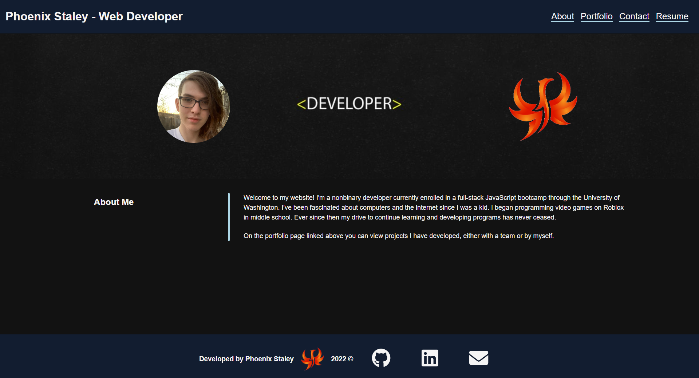
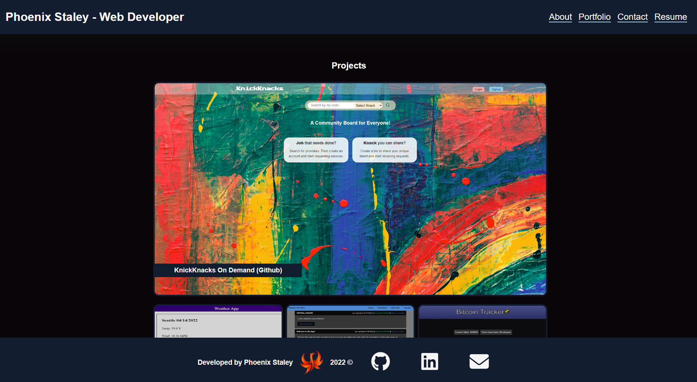

### Apache-2.0 License
 

# Title

## Table of Contents

- [Description](#Description)

- [Technologies](#Technologies)

- [Images](#Examples)

- [Credits](#Credits)

## Description
This is a professional portfolio for Phoenix Staley. This portfolio is based on a previous portfolio written using basic HTML and CSS instead of ReactJS. You can view the Github repository for [the original portfolio](https://phoenix-staley.github.io/phoenix-staley-portfolio/).

View the site [here](https://phoenix-staley.github.io/myReactPortfolio/)!

## Technologies
This portfolio is written using ReactJS. It uses React's state variables to update the page dynamically without the need for any vanilla JavaScript. This single page application creates the feeling of multiple "pages" using these state variables to keep track of which "page" the user is on and loading the corresponding components accordingly.

## Images

Homepage:

Projects:

## Credits
This website was created by Phoenix Staley, a full-stack (MERN) web developer currently studying computer science through Washington State University.